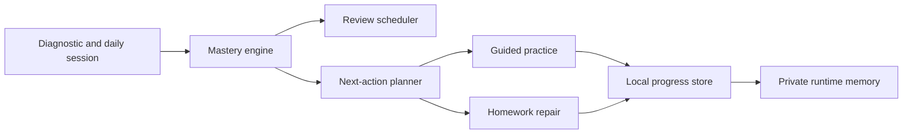

<p align="center">
  
</p>

<h1 align="center">MathPilot</h1>

<p align="center">
  A private, local-first calculus learning cockpit for diagnosis, practice, review, and homework repair.
</p>

<p align="center">
  <a href="https://github.com/ezzy1630/MathPilot/actions/workflows/ci.yml"></a>
  
  
  
  
</p>

---

## What It Is

MathPilot is a desktop study app built around a simple idea: calculus practice should adapt to what the learner has actually proven, not what a chatbot guessed.

It combines:

- diagnostic routing for Calculus 1 and Calculus 2
- mastery tracking with delayed mixed review before a skill is trusted
- step-aware answer checking and symbolic validation
- homework upload and repair workflows
- local learning memory, backups, and progress state
- optional Codex CLI support for richer tutoring packets

The app is intentionally local-first. Personal progress, memory files, retained homework images, and backups live in local app data and are ignored by Git.

## Product Shape



MathPilot is not a generic flashcard app. It is designed for:

- strict mastery standards
- visible reasoning and worked steps
- prerequisite repair before advancing
- practice modes that separate guided learning from test-like evidence
- an interface that feels like a focused study desk, not a game

## Tech Stack

| Area | Stack |
| --- | --- |
| Desktop shell | Tauri 2, Rust, SQLite |
| Frontend | React 19, TypeScript, Vite |
| Math input | MathLive |
| Charts and UI | Recharts, custom UI primitives, Lucide icons |
| Tests | Vitest, Playwright |
| Workspace | pnpm monorepo |

## Repository Layout

```text
apps/desktop/              Tauri + React desktop app
packages/learning-engine/  shared learning-engine package
packages/*/                package boundaries for future extraction
config/                    public default course/source/app config
skills/                    checked-in app skill prompts
scripts/                   local helper scripts for math/OCR workflows
docs/                      specs, audits, and release hygiene notes
```

Runtime data is deliberately excluded:

```text
memory/                    ignored local memory scratch space
data/                      ignored local backups and retained homework images
*.sqlite, *.db             ignored local databases
config/*.local.json        ignored personal config overlays
```

## Quick Start

Requirements:

- Node.js 22
- pnpm 9+
- Rust toolchain for Tauri desktop builds
- Python 3 for optional symbolic/OCR helper scripts

Install and run the web dev shell:

```bash
pnpm install
pnpm dev
```

Run the Tauri desktop app:

```bash
pnpm --filter @mathpilot/desktop desktop:dev
```

Run the main verification suite:

```bash
pnpm lint
pnpm test
pnpm build
```

Run Playwright smoke coverage:

```bash
pnpm test:e2e
```

## Privacy Model

MathPilot separates public source from private usage data.

Public Git should contain:

- source code
- neutral defaults
- course graphs and trusted-source config
- reusable skill prompts
- tests, docs, and CI config

Public Git should never contain:

- personal learning history
- profile memory
- homework images
- generated backups
- local SQLite databases
- API keys, tokens, or environment files

In the desktop app, runtime state is stored under the operating system's app-data directory. In browser-only dev mode, state uses browser localStorage. Both are outside the publishable source tree.

## Future Update Workflow

Use this repo as the clean base.

1. Keep normal MathPilot studying in the installed/local app. That data stays private.
2. When changing the product, edit source files in this repo.
3. Before publishing, run:

   ```bash
   git status --short
   pnpm lint
   pnpm test
   pnpm build
   ```

4. Review the diff for runtime files or personal values.
5. Commit only source, docs, tests, and neutral config.

The detailed checklist lives in [docs/RELEASE_HYGIENE.md](docs/RELEASE_HYGIENE.md).

## CI

GitHub Actions runs:

- dependency install with a frozen pnpm lockfile
- ESLint
- Vitest unit tests
- production build
- Playwright smoke tests

## Status

MathPilot is an early desktop product. The current codebase includes the core learning engine, local persistence, review scheduling, homework analysis surfaces, and a polished study cockpit foundation.

## License

MIT. See [LICENSE](LICENSE).
