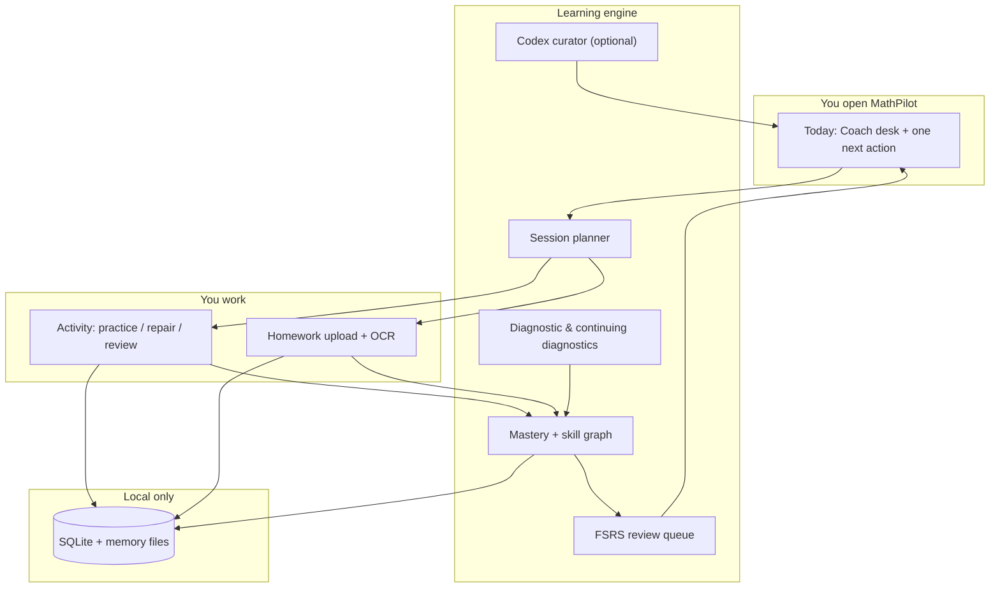

<p align="center">
  
</p>

<h1 align="center">MathPilot</h1>

<p align="center">
  <strong>Your private calculus mastery engine for macOS.</strong><br>
  Diagnose what you know · practice what matters · review before you forget — no cloud account required.
</p>

<p align="center">
  <a href="https://github.com/ezzy1630/MathPilot/actions/workflows/ci.yml"></a>
  
  
  
  
</p>

<p align="center">
  <a href="#-highlights">Highlights</a> ·
  <a href="#-features">Features</a> ·
  <a href="#-how-it-works">How it works</a> ·
  <a href="#-install">Install</a> ·
  <a href="#-develop">Develop</a> ·
  <a href="MathPilot_spec.md">Spec</a>
</p>

<br>

<table align="center">
  <tr>
    <td align="center" width="180">
      <h3>1,080+</h3>
      <sub>Curated Calc 1 &amp; 2 problems</sub>
    </td>
    <td align="center" width="180">
      <h3>171</h3>
      <sub>Unit tests · 15 E2E</sub>
    </td>
    <td align="center" width="180">
      <h3>Zero</h3>
      <sub>Cloud accounts or API keys required</sub>
    </td>
    <td align="center" width="180">
      <h3>One</h3>
      <sub>Clear next action on Today</sub>
    </td>
  </tr>
</table>

<br>

---

## What is MathPilot?

MathPilot is a **personal calculus study cockpit** for **Calculus 1** and **Calculus 2**. It is not a chatbot wrapper, not an LMS, and not a video playlist. It is a structured learning system that:

| Step | What happens |
|:----:|--------------|
| **1** | **Diagnose** your level with an adaptive, branching assessment |
| **2** | **Track mastery** on a skill graph with strict, evidence-based rules |
| **3** | **Coach you** — one clear recommended action on the Today desk |
| **4** | **Teach through practice** — typeset math, hints, repair flows, spaced review |
| **5** | **Stay on your Mac** — progress, memory, and homework analysis live locally |

> **Open the app → see Continue → start the best next step.**  
> Everything else — map, resources, homework, settings — stays one click away.

<br>

## ✨ Highlights

<table>
  <tr>
    <td width="50%" valign="top">

### Coach desk, not a dashboard

Today is your **Coach desk**: a short insight naming your current blocker, one recommended action with evidence, and session pace controls (Short → Deep). Homework, resources, and analytics stay in a quiet drawer — available, not competing for attention.

### Typeset math everywhere

Problem prompts, choices, hints, and worked examples render through **MathLive** with an auto-derived LaTeX enrichment pipeline. Calculus notation looks like calculus — not plain text with `^` and `/` symbols.

    </td>
    <td width="50%" valign="top">

### Codex-first, works offline

Optional **Codex CLI** powers coach insights, homework analysis, maintenance, and problem generation — with deterministic fallbacks when AI is unavailable. No in-app API key. Manual ChatGPT/Gemini packet export as backup.

### Release-ready macOS shell

Native **Tauri 2** app with bundled **Python + SymPy** for symbolic checking and **Vision OCR** for homework photos. Sidebar navigation, command palette, and a restrained macOS-native palette.

    </td>
  </tr>
</table>

<br>

## 🧭 Features

<details open>
<summary><strong>Core learning loop</strong></summary>
<br>

| Area | What you get |
|------|--------------|
| **Today / Continue** | Coach insight, one recommended next action, adjustable pace (Short → Deep, Custom), collapsible “more for today” tray |
| **Knowledge map** | ALEKS-inspired wheel, list, and prerequisite tree — mastery states reflect real evidence, not guesswork |
| **Activity studio** | Guided & independent practice, formula recall, video resources, Desmos + built-in graphs (polar, parametric, series, related rates), step-aware feedback |
| **Mastery engine** | Delayed mixed review before “Mastered,” prerequisite gates, test-out, and quick repair |
| **Review** | FSRS-style scheduling (`ts-fsrs`), interleaving, multiple review item types |
| **Homework** | Upload or paste work, step-level feedback, repair CTAs; images discarded by default |
| **Diagnostics** | Initial + continuing diagnostics with branching probes and course-focus filtering |
| **Analytics** | Mastery depth, attempt history, progress reports — inspectable without dashboard clutter |

</details>

<details>
<summary><strong>AI &amp; maintenance (optional)</strong></summary>
<br>

| Area | What you get |
|------|--------------|
| **Codex CLI** | Coach curator, homework cluster analysis, maintenance passes, continuing-diagnostic probes — all with offline fallbacks |
| **Problem generation** | Codex-generated problems (Developer mode toggle) plus 1,080+ banked items from the skill catalog |
| **SymPy verification** | Symbolic answer checking when the bundled Python runtime is present |
| **Self-improvement** | Local skill-file patching and safe maintenance runs |

</details>

<details>
<summary><strong>Privacy &amp; data</strong></summary>
<br>

| | |
|---|---|
| **No cloud account** | SQLite + local memory files under Application Support |
| **Export / reset** | Full data export and typed `RESET` in Settings |
| **Homework images** | Processed locally via Vision OCR; discarded by default |
| **What's never committed** | `memory/`, `data/`, `*.sqlite`, homework images, API keys, `config/*.local.json` |

</details>

<br>

## ⚙️ How it works



MathPilot optimizes for **durable mastery**, not same-day fluency: hints count, mixed review matters, and prerequisites block reckless advancement — with test-out and override when you choose.

<br>

## 📦 Install

### macOS app (recommended)

**Quick install** — builds if needed, tries a non-sudo copy first:

```bash
git clone https://github.com/ezzy1630/MathPilot.git
cd MathPilot
./scripts/install-mathpilot-macos.sh
open -a MathPilot
```

**Manual build:**

```bash
pnpm install
./scripts/build-macos-python-runtime.sh   # bundle Python + SymPy (macOS arm64)
pnpm --filter @mathpilot/desktop desktop:build
cp -R apps/desktop/src-tauri/target/release/bundle/macos/MathPilot.app /Applications/
open -a MathPilot
```

### First-run setup

No `pip install` or Python setup is required for normal use. Release builds ship a **bundled Python + SymPy runtime** for symbolic answer checking.

| Step | Action |
|:----:|--------|
| 1 | Choose **Calculus 1** or **Calculus 2**, complete the short diagnostic |
| 2 | Symbolic checking is ready immediately (bundled runtime included) |
| 3 | **Optional:** install and sign in to **Codex CLI** for AI coach help, homework analysis, and generated problems |
| 4 | Homework OCR uses the native Vision helper on macOS release builds |

<details>
<summary><strong>Data location &amp; reset</strong></summary>
<br>

Local data lives at:

```
~/Library/Application Support/local.mathpilot.desktop/
```

To start completely fresh, quit the app and remove that folder — or use **Settings → Reset** and type `RESET`.

Manual QA checklist: [docs/MANUAL_QA_CHECKLIST.md](docs/MANUAL_QA_CHECKLIST.md)

</details>

<br>

## 🛠 Develop

### Requirements

| Tool | Version |
|------|---------|
| **Node.js** | 22 |
| **pnpm** | 9+ |
| **Rust** | latest stable (for Tauri) |
| **Python 3** | optional — repo `.venv` or macOS runtime build script |

### Commands

```bash
pnpm install

# macOS release packaging: bundle portable Python + SymPy before tauri build
./scripts/build-macos-python-runtime.sh

# Web UI only (fast iteration)
pnpm dev

# Full desktop app
pnpm --filter @mathpilot/desktop desktop:dev

# Verify
pnpm lint && pnpm test && pnpm build && pnpm test:e2e
cargo test --lib --manifest-path apps/desktop/src-tauri/Cargo.toml
```

### Repository layout

```text
apps/desktop/                 Tauri 2 + React 19 app (UI + domain)
packages/
  learning-engine/            Mastery, review, diagnostics (FSRS)
  content-engine/             Resource ranking & search
  math-engine/                Answer checking
  ai-adapter/                 Codex CLI integration
  ui/                         Shared components
config/                       Course graphs, sources, problem bank JSON
skills/                       Local teaching / grading skill prompts
scripts/                      SymPy, OCR helpers, install & bundle scripts
docs/                         Spec audit, QA, release hygiene
```

### Tech stack

<p>
  
  
  
  
  
  
  
  
</p>

<details>
<summary><strong>Regenerate the app icon</strong></summary>
<br>

```bash
cd apps/desktop
pnpm exec tauri icon app-icon-square.png -o src-tauri/icons
pnpm desktop:build
```

Sources: `app-icon-square.png`, `app-icon-source.svg`. See [apps/desktop/ICONS.md](apps/desktop/ICONS.md).

</details>

<br>

## 📚 Documentation

| Document | Purpose |
|----------|---------|
| [MathPilot_spec.md](MathPilot_spec.md) | Full product specification |
| [PRODUCT.md](PRODUCT.md) | Brand and UX principles |
| [docs/GAP_AUDIT.md](docs/GAP_AUDIT.md) | §0–§30 implementation checklist |
| [docs/MANUAL_QA_CHECKLIST.md](docs/MANUAL_QA_CHECKLIST.md) | Tauri manual test pass |
| [docs/PRE_REAL_USE.md](docs/PRE_REAL_USE.md) | Author checklist before daily use |
| [docs/RELEASE_HYGIENE.md](docs/RELEASE_HYGIENE.md) | Release and privacy hygiene |
| [CHANGELOG.md](CHANGELOG.md) | Notable changes |

<br>

## 🔬 CI

GitHub Actions on every push and PR:

| Check | Detail |
|-------|--------|
| **Lint** | ESLint across the desktop app |
| **Unit tests** | 171 Vitest tests across 50 files |
| **E2E** | 15 Playwright tests (acceptance, smoke, visual, math display) |
| **Build** | Production Vite build |
| **Rust** | Migration and lib tests |
| **macOS** | Desktop bundle build on `main` |

<br>

## 📋 Status

MathPilot implements the full [product spec](MathPilot_spec.md): core learning loop, 1,080+ banked problems, Codex integration with offline fallbacks, typeset math display, homework analysis, maintenance, and a native macOS shell with bundled Python + SymPy. Optional **HealthKit** is documented as N/A; Bevel energy import and pace presets are available in Settings.

<br>

---

<p align="center">
  <sub>MIT License · see <a href="LICENSE">LICENSE</a></sub>
</p>
