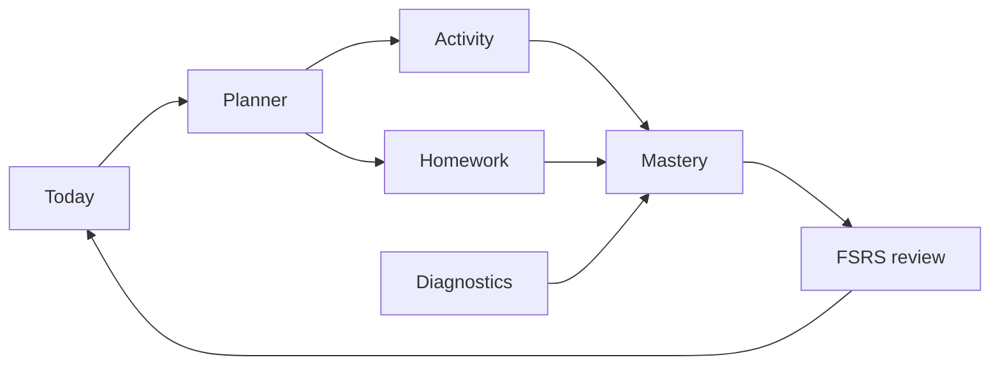

<p align="center">
  
</p>

<p align="center">
  <a href="https://github.com/ezzy1630/MathPilot/actions/workflows/ci.yml"></a>
  
  
  
</p>

<p align="center">
  <a href="#highlights">Highlights</a> ·
  <a href="#features">Features</a> ·
  <a href="#how-it-works">How it works</a> ·
  <a href="#install">Install</a> ·
  <a href="#develop">Develop</a> ·
  <a href="MathPilot_spec.md">Spec</a>
</p>

| **1,080+** problems | **171** unit · **15** E2E tests | **Zero** cloud accounts | **One** next action |
| :-----------------: | :-----------------------------: | :---------------------: | :-----------------: |

## What is MathPilot?

A **local-first calculus study cockpit** for **Calculus 1 & 2** — not a chatbot, LMS, or video playlist. MathPilot diagnoses your level, tracks mastery on a skill graph, coaches your next step, and keeps everything on your Mac.

| | |
| --- | --- |
| **Diagnose** | Adaptive, branching assessment |
| **Track** | Evidence-based mastery + prerequisites |
| **Coach** | One clear action on the Today desk |
| **Practice** | Typeset math, hints, repair, spaced review |
| **Stay local** | SQLite + memory files — no cloud account |

> Open the app → **Continue** → start the best next step. Map, homework, and settings stay one click away.

## Highlights

| | |
| --- | --- |
| **Coach desk** | Blocker insight, one recommended action, pace controls (Short → Deep). No dashboard clutter. |
| **Typeset math** | Prompts, hints, and choices render via **MathLive** + auto LaTeX enrichment — not plain `x^2` text. |
| **Codex-first** | Optional **Codex CLI** for coach, homework, and maintenance — with offline fallbacks. No in-app API key. |
| **Native macOS** | **Tauri 2** shell, bundled **Python + SymPy**, **Vision OCR**, command palette. |

## Features

| Area | What you get |
| --- | --- |
| **Today** | Coach insight, recommended action, adjustable session pace |
| **Map** | ALEKS-style wheel, list, and prerequisite tree |
| **Activity** | Practice, formula recall, Desmos + built-in graphs, step-aware feedback |
| **Review** | FSRS scheduling, interleaving, mixed cumulative review |
| **Homework** | Upload/paste, step feedback, local OCR; images discarded by default |
| **AI (optional)** | Codex curator + deterministic fallbacks; SymPy symbolic checking |
| **Privacy** | No cloud account; export/reset in Settings |

## How it works



MathPilot optimizes for **durable mastery**: hints count, mixed review matters, prerequisites gate advancement (with test-out when you're ready).

## Install

```bash
git clone https://github.com/ezzy1630/MathPilot.git
cd MathPilot
./scripts/install-mathpilot-macos.sh
open -a MathPilot
```

Release builds include bundled **Python + SymPy** and **Vision OCR** — no `pip install` needed.

<details>
<summary>Manual build, first-run, and data location</summary>

```bash
pnpm install
./scripts/build-macos-python-runtime.sh
pnpm --filter @mathpilot/desktop desktop:build
cp -R apps/desktop/src-tauri/target/release/bundle/macos/MathPilot.app /Applications/
```

1. Choose **Calculus 1** or **Calculus 2**, complete the diagnostic.
2. Symbolic checking works immediately (bundled runtime).
3. **Optional:** sign in to **Codex CLI** for AI coach and homework analysis.

Data: `~/Library/Application Support/local.mathpilot.desktop/` — delete or **Settings → Reset** (`RESET`) to start fresh.

</details>

## Develop

```bash
pnpm install && pnpm dev                              # web UI
pnpm --filter @mathpilot/desktop desktop:dev          # full app
pnpm lint && pnpm test && pnpm build && pnpm test:e2e # verify
```

| Tool | Version |
| --- | --- |
| Node.js | 22 · pnpm 9+ · Rust (Tauri) · Python 3 optional |

**Stack:** Tauri 2 · React 19 · TypeScript · MathLive · Tailwind 4 · SQLite · SymPy · FSRS

**Layout:** `apps/desktop/` (UI) · `packages/learning-engine` · `content-engine` · `math-engine` · `ai-adapter` · `config/` · `skills/`

## Docs

[Spec](MathPilot_spec.md) · [Product](PRODUCT.md) · [Gap audit](docs/GAP_AUDIT.md) · [QA checklist](docs/MANUAL_QA_CHECKLIST.md) · [Changelog](CHANGELOG.md)

---

<p align="center">
  <sub>MIT License · <a href="LICENSE">LICENSE</a></sub>
</p>
