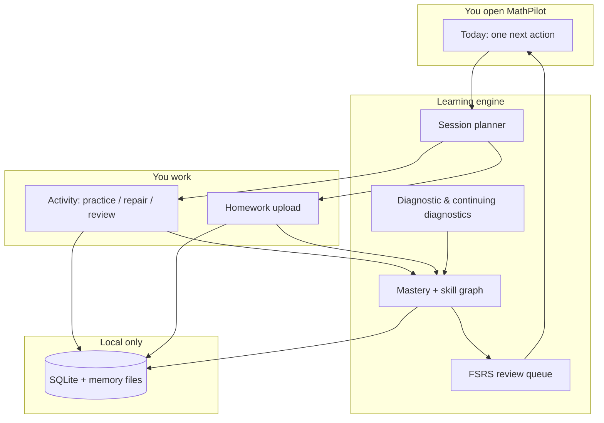

<p align="center">
  
</p>

<h1 align="center">MathPilot</h1>

<p align="center">
  <strong>A private, local-first calculus mastery engine for macOS.</strong><br>
  Diagnose what you know, practice what matters, review before you forget — without a cloud account.
</p>

<p align="center">
  <a href="https://github.com/ezzy1630/MathPilot/actions/workflows/ci.yml"></a>
  
  
  
  
</p>

<p align="center">
  <a href="#install">Install</a> ·
  <a href="#features">Features</a> ·
  <a href="#how-it-works">How it works</a> ·
  <a href="#develop">Develop</a> ·
  <a href="MathPilot_spec.md">Spec</a> ·
  <a href="docs/GAP_AUDIT.md">Gap audit</a>
</p>

---

## What is MathPilot?

MathPilot is a **personal calculus study cockpit** for **Calculus 1** and **Calculus 2**. It is not a chatbot wrapper, not an LMS, and not a video playlist. It is a structured learning system that:

1. **Diagnoses** your level with an adaptive assessment  
2. **Tracks mastery** on a skill graph with strict, evidence-based rules  
3. **Tells you what to do next** — one clear action on the Today screen  
4. **Teaches through practice** — MathLive input, hints, repair flows, spaced review  
5. **Stays on your Mac** — progress, memory, and homework analysis live in local app data  

Open the app → see **Continue** → start the best next step. Everything else (map, resources, homework, settings) stays one click away.

<p align="center">
  
</p>

---

## Features

| Area | What you get |
|------|----------------|
| **Today / Continue** | One recommended next action, adjustable pace (Short → Deep, Custom), and a collapsible “more for today” tray |
| **Knowledge map** | ALEKS-inspired wheel, list, and prerequisite tree with mastery states that reflect real evidence |
| **Activity studio** | Guided and independent practice, formula recall, video resources, Desmos + built-in graphs, step-aware feedback |
| **Mastery engine** | Delayed mixed review before “Mastered,” prerequisite gates, test-out, and quick repair |
| **Review** | FSRS-style scheduling (`ts-fsrs`), interleaving, and multiple review item types |
| **Homework** | Upload or paste work, step-level feedback, repair CTAs; images discarded by default |
| **AI (optional)** | Codex CLI for help and analysis; manual ChatGPT/Gemini packet fallback — no API key required in-app |
| **Privacy** | No cloud account; SQLite + local memory; export/reset in Settings |

**Problem bank:** 1,000+ curated items (Calc 1 & 2) generated from the skill catalog, plus templates and SymPy verification when Python is available.

---

## How it works



MathPilot optimizes for **durable mastery**, not same-day fluency: hints count, mixed review matters, and prerequisites block reckless advancement (with test-out and override when you choose).

---

## Install

### macOS app (recommended)

Build from source and copy the bundle to Applications:

```bash
git clone https://github.com/ezzy1630/MathPilot.git
cd MathPilot
pnpm install
./scripts/build-macos-python-runtime.sh   # maintainer: bundle Python + SymPy (macOS arm64)
pnpm --filter @mathpilot/desktop desktop:build
cp -R apps/desktop/src-tauri/target/release/bundle/macos/MathPilot.app /Applications/
open -a MathPilot
```

Or use the install script (builds if needed, prompts for sudo when replacing `/Applications/MathPilot.app`):

```bash
./scripts/install-mathpilot-macos.sh
```

**First-run setup**

| Step | Action |
|------|--------|
| 1 | Choose **Calculus 1** or **Calculus 2**, complete the short diagnostic |
| 2 | Symbolic answer checking works out of the box when the app was built with the bundled Python runtime |
| 3 | Optional: install and sign in to **Codex CLI** for richer AI help |
| 4 | Homework OCR uses the native Vision helper on macOS release builds |

Local data is stored at:

`~/Library/Application Support/local.mathpilot.desktop/`

To start completely fresh, quit the app and remove that folder (or use **Settings → Reset** and type `RESET`).

Manual QA checklist: [docs/MANUAL_QA_CHECKLIST.md](docs/MANUAL_QA_CHECKLIST.md)

---

## Develop

### Requirements

- **Node.js** 22  
- **pnpm** 9+  
- **Rust** (for Tauri)  
- **Python 3** (optional for local dev — use repo `.venv` or run the macOS runtime build script)

### Commands

```bash
pnpm install

# macOS release packaging: bundle portable Python + SymPy before tauri build
./scripts/build-macos-python-runtime.sh

# Web UI only (fast iteration)
pnpm dev

# Full desktop app
pnpm --filter @mathpilot/desktop desktop:dev

# Verify
pnpm lint && pnpm test && pnpm build && pnpm test:e2e
cargo test --lib --manifest-path apps/desktop/src-tauri/Cargo.toml
```

### Repository layout

```text
apps/desktop/                 Tauri 2 + React 19 app (UI + domain)
packages/
  learning-engine/            Mastery, review, diagnostics (FSRS)
  content-engine/             Resource ranking & search
  math-engine/                Answer checking
  ai-adapter/                 Codex CLI integration
  ui/                         Shared components
config/                       Course graphs, sources, problem bank JSON
skills/                       Local teaching / grading skill prompts
scripts/                      SymPy & OCR helpers
docs/                         Spec audit, QA, release hygiene
```

**Private by design** — never committed: `memory/`, `data/`, `*.sqlite`, homework images, API keys, `config/*.local.json`.

### Regenerate the app icon

```bash
cd apps/desktop
pnpm exec tauri icon app-icon-square.png -o src-tauri/icons
pnpm desktop:build
```

Sources: `app-icon-square.png`, `app-icon-source.svg`. See [apps/desktop/ICONS.md](apps/desktop/ICONS.md).

---

## Privacy

| In Git (public) | On your Mac only |
|-----------------|------------------|
| Source, tests, neutral config | Mastery, attempts, review queue |
| Course graphs, skill prompts | `memory/` markdown, backups |
| Curated problem bank | Homework images (optional save) |
| | SQLite at `local.mathpilot.desktop` |

Browser dev mode uses `localStorage` as a fallback; the shipped app uses SQLite under Application Support.

Release hygiene: [docs/RELEASE_HYGIENE.md](docs/RELEASE_HYGIENE.md)

---

## Documentation

| Document | Purpose |
|----------|---------|
| [MathPilot_spec.md](MathPilot_spec.md) | Full product specification |
| [docs/GAP_AUDIT.md](docs/GAP_AUDIT.md) | §0–§30 implementation checklist |
| [docs/MANUAL_QA_CHECKLIST.md](docs/MANUAL_QA_CHECKLIST.md) | Tauri manual test pass |
| [PRODUCT.md](PRODUCT.md) | Brand and UX principles |
| [CHANGELOG.md](CHANGELOG.md) | Notable changes |

---

## CI

GitHub Actions on every push/PR:

- ESLint · Vitest (125+ unit tests) · production build  
- Playwright E2E (14 tests) · Rust migration tests  
- macOS desktop build on `main`

---

## Status

MathPilot implements the full [product spec](MathPilot_spec.md): core learning loop, 1,000+ banked problems, Codex integration, homework analysis, maintenance, and a native macOS shell. Optional **HealthKit** is documented as N/A; Bevel energy import and pace presets are available in Settings.

---

## License

MIT — see [LICENSE](LICENSE).
