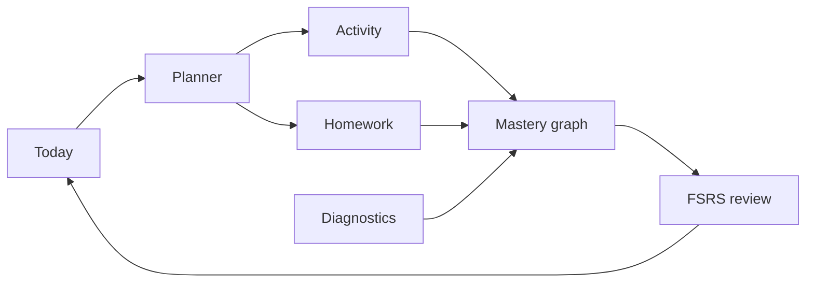

<p align="center">
  
</p>

<p align="center">
  <a href="https://github.com/ezzy1630/MathPilot/actions/workflows/ci.yml"></a>
  <a href="#install"></a>
  
  
  
</p>

<p align="center">
  <a href="#highlights">Highlights</a> ·
  <a href="#features">Features</a> ·
  <a href="#how-it-works">How it works</a> ·
  <a href="#install">Install</a> ·
  <a href="#develop">Develop</a> ·
  <a href="MathPilot_spec.md">Spec</a>
</p>

<p align="center">
  <strong>1,080+</strong> curated problems &nbsp;·&nbsp;
  <strong>171</strong> unit tests &nbsp;·&nbsp;
  <strong>15</strong> E2E &nbsp;·&nbsp;
  zero cloud accounts
</p>

## What is MathPilot?

MathPilot is a **local-first calculus study cockpit** for **Calculus 1 & 2**. It diagnoses your level, tracks mastery on a skill graph, coaches your next step, and keeps progress on your Mac — no LMS, no chatbot wrapper, no video playlist.

<p align="center">
  
</p>

> **Open the app → Continue → start the best next step.** Map, homework, resources, and settings stay one click away.

## Highlights

| Topic | Why it matters |
| ----- | -------------- |
| Coach desk | Today names your blocker, shows one recommended action with evidence, and keeps everything else in a quiet drawer. |
| Typeset math | Prompts, hints, and choices render through MathLive with auto LaTeX enrichment — not plain `x^2` text. |
| Codex-first | Optional Codex CLI for coach, homework, and maintenance — with deterministic offline fallbacks. No in-app API key. |
| Native macOS | Tauri 2 shell, bundled Python + SymPy, Vision OCR, sidebar navigation, and command palette. |

## Features

| Area | What you get |
| ---- | ------------ |
| Today | Coach insight, recommended action, session pace (Short → Deep) |
| Map | ALEKS-style wheel, list view, and prerequisite tree |
| Activity | Practice, formula recall, Desmos + built-in graphs, step-aware feedback |
| Review | FSRS scheduling, interleaving, mixed cumulative review |
| Homework | Upload or paste, step feedback, local OCR; images discarded by default |
| AI (optional) | Codex curator, SymPy symbolic checking, problem generation in Developer mode |
| Privacy | SQLite + local memory; export and typed reset in Settings |

## How it works



MathPilot optimizes for **durable mastery** — hints count, mixed review matters, and prerequisites gate advancement until you test out or override.

## Install

```bash
git clone https://github.com/ezzy1630/MathPilot.git
cd MathPilot
./scripts/install-mathpilot-macos.sh
open -a MathPilot
```

Release builds ship bundled **Python + SymPy** and **Vision OCR**. No `pip install` required.

<details>
<summary>Manual build, first-run setup, and data location</summary>

```bash
pnpm install
./scripts/build-macos-python-runtime.sh
pnpm --filter @mathpilot/desktop desktop:build
cp -R apps/desktop/src-tauri/target/release/bundle/macos/MathPilot.app /Applications/
```

1. Choose **Calculus 1** or **Calculus 2** and complete the diagnostic.
2. Symbolic checking works immediately via the bundled runtime.
3. Optionally sign in to **Codex CLI** for AI coach and homework analysis.

Local data: `~/Library/Application Support/local.mathpilot.desktop/`  
Reset: quit the app, delete that folder, or use **Settings → Reset** and type `RESET`.

</details>

## Develop

```bash
pnpm install && pnpm dev                              # web UI
pnpm --filter @mathpilot/desktop desktop:dev          # full desktop app
pnpm lint && pnpm test && pnpm build && pnpm test:e2e # verify
```

| Tool | Version |
| ---- | ------- |
| Node.js | 22 |
| pnpm | 9+ |
| Rust | latest stable (Tauri) |
| Python | optional — repo `.venv` or runtime build script |

**Stack:** Tauri 2 · React 19 · TypeScript · MathLive · Tailwind 4 · SQLite · SymPy · FSRS

**Monorepo:** `apps/desktop/` · `packages/learning-engine` · `content-engine` · `math-engine` · `ai-adapter` · `config/` · `skills/`

## Documentation

[Spec](MathPilot_spec.md) · [Product](PRODUCT.md) · [Gap audit](docs/GAP_AUDIT.md) · [Production certification](docs/PRODUCTION_CERTIFICATION.md) · [QA checklist](docs/MANUAL_QA_CHECKLIST.md) · [Changelog](CHANGELOG.md)

---

<p align="center">
  <sub>MIT License · <a href="LICENSE">LICENSE</a></sub>
</p>
